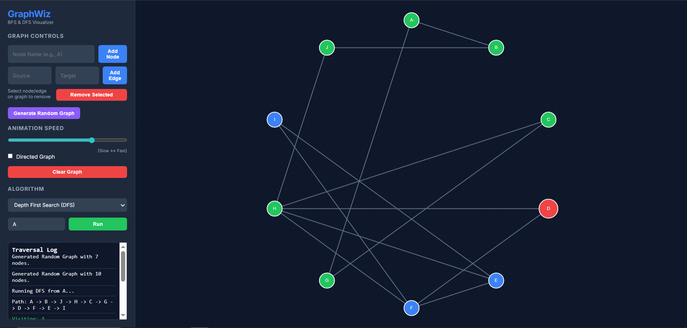

# GraphWiz - Graph Traversal Visualizer



[🚀 **Live Demo**](https://graphwiz-two.vercel.app/)

A premium, interactive Web Application for visualizing Graph Traversal algorithms. Built with **Python (Flask)** and **Cytoscape.js**, this project provides a dynamic way to understand Breadth First Search (BFS) and Depth First Search (DFS).

## 🚀 Features

### Core Functionality
- **BFS & DFS Algorithms**: Watch the algorithms traverse the graph step-by-step.
- **Interactive Graph Editor**:
  - **Add Nodes**: Custom naming support.
  - **Add Edges**: Connect nodes easily.
  - **Directed & Undirected**: Toggle graph type at any time.
- **Graph Editing**:
  - **Remove Selected**: Click any node or edge and remove it instantly.
  - **Clear Graph**: Reset the canvas with one click.

### Advanced Features
- **🎲 Random Graph Generator**: Instantly generate complex, random graphs to test algorithms without manual setup.
- **⚡ Animation Speed Control**: Adjust the visualization speed with a slider (Slow ↔ Fast) to follow the logic at your own pace.
- **Responsive Design**: Modern, dark-themed UI built with CSS3 and Glassmorphism aesthetics.

## 🛠️ Technologies Used
- **Backend**: Python 3, Flask framework.
- **Frontend**: HTML5, CSS3, JavaScript.
- **Visualization Library**: Cytoscape.js (for powerful graph rendering and animation).

## 📦 Installation & Setup

1.  **Clone/Navigate to the directory**:
    git clone https://github.com/priyamkapadiya07/GraphWiz.git
    cd GraphWiz
    ```

2.  **Install Dependencies**:
    ```bash
    pip install -r requirements.txt
    ```

## ▶️ How to Run

1.  **Start the Server**:
    ```bash
    python app.py
    ```

2.  **Open in Browser**:
    Go to [http://127.0.0.1:5000](http://127.0.0.1:5000)

## 🎮 user Guide

1.  **Create a Graph**: use the inputs on the left to add nodes (e.g., 'A', 'B') and edges (e.g., 'A' -> 'B').
    - *Tip*: Use the **"Generate Random Graph"** button for a quick start!
2.  **Select Algorithm**: Choose between BFS or DFS from the dropdown.
3.  **Set Start Node**: Enter the node ID where you want the traversal to begin.
4.  **Run**: Click "Run" and watch the animation.
5.  **Control Speed**: Use the slider to slow down or speed up the animation while it runs.

## 👥 Author
**PRIYAM KAPADIYA**
